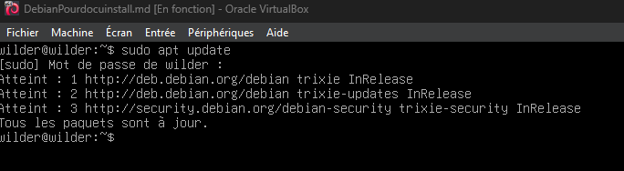
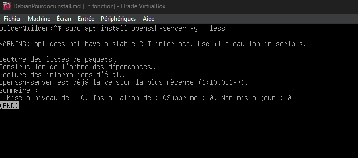
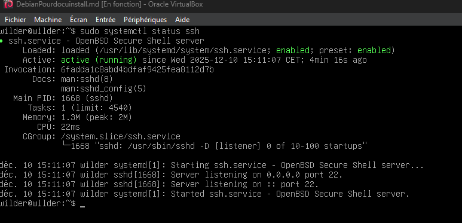
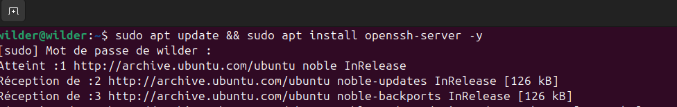
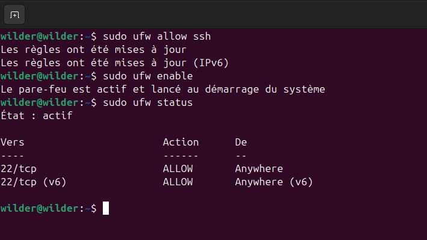
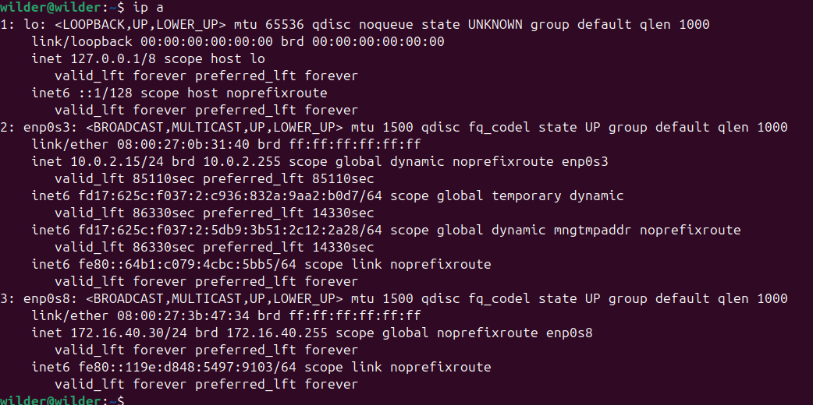

# TSSR-1025-P2-G4

## Sommaire

* [Connexions ssh des machines du réseau](#connexion-ssh-)
* [Installation de nmap sur le serveur Debian](#installation-nmap-)
* [Installation de putty sur le serveur windows ](#installation-putty-)

## Connexions ssh des machines du réseau :

1. Introduction
Le protocole SSH (Secure Shell) est la brique fondamentale de ce projet d'administration centralisée. Il permet :
L'accès distant sécurisé au poste Client Ubuntu .
L'exécution de commandes à distance par le script Bash sur le serveur d'administration Debian.

3. Prérequis techniques
Avant de lancer l'installation, assurez-vous que les machines respectent les critères suivants définis dans l'infrastructure du projet :
Serveur : Debian 12/13 (SRVLX01) avec accès root ou sudo
Client : Ubuntu 24 LTS (CLILIN01) avec accès sudo.
Réseau : Les machines doivent avoir une adresse IP configurée dans le sous-réseau 172.16.xx.0/24 et un accès Internet pour télécharger les paquets.

3. Installation sur le Serveur Debian (SRVLX01)
Étape 1 : Mise à jour du système
Connectez-vous avec l'utilisateur wilder (ou root) et mettez à jour les dépôts.

sudo apt update

Étape 2 : Installation du paquet OpenSSH-Server
Lancez la commande d'installation :

sudo apt install openssh-server -y
L'option -y confirme automatiquement l'installation des dépendances.

Étape 3 : Vérification du service
Assurez-vous que le service est démarré et actif :

sudo systemctl status ssh
Résultat attendu : Le statut doit indiquer active (running) en vert.

4. Installation sur le Client Ubuntu (CLILIN01)
Le client Ubuntu doit également disposer du service SSH pour être piloté par le script d'administration.

Étape 1 : Installation
Sur la machine CLILIN01, ouvrez un terminal et exécutez :

sudo apt update && sudo apt install openssh-server -y

Étape 2 : Configuration du Pare-feu (UFW)
Ubuntu active souvent le pare-feu par défaut. Il faut autoriser le port SSH (22).

sudo ufw allow ssh
sudo ufw enable
sudo ufw status
Résultat attendu : La règle 22/tcp ALLOW doit apparaître.

Étape 3 : Validation de la connectivité
Relevez l'adresse IP du client Ubuntu :

ip a

(L'IP doit correspondre à 172.16.xx.30 selon votre groupe )

## Installation de nmap sur le serveur Debian :

1. Introduction
Ce document détaille la procédure technique pour installer l'outil Nmap (Network Mapper) sur le serveur Debian de l'infrastructure. Nmap est une dépendance requise pour permettre au script d'administration d'effectuer des opérations de découverte réseau et d'audit de sécurité.

2. Prérequis techniques
Avant de procéder à l'installation, assurez-vous que les conditions suivantes sont remplies sur la machine cible:

Machine cible : Serveur Debian (SRVLX01).

Système d'exploitation : Debian 12 ou 13 (CLI).

Droits d'accès : Accès au compte root ou à un utilisateur disposant des privilèges sudo (ex: wilder).

Réseau : La machine doit disposer d'un accès à Internet pour télécharger les paquets depuis les dépôts officiels.

3. Procédure d'installation
Cette section décrit les étapes à suivre ligne par ligne pour installer l'outil.

Étape 1 : Mise à jour des dépôts
Il est impératif de mettre à jour la liste des paquets locaux pour s'assurer de télécharger la dernière version disponible.

Ouvrez votre terminal sur le serveur Debian.

Exécutez la commande suivante :

Bash

sudo apt update
Note : Si vous êtes connecté en root, la commande sudo n'est pas nécessaire.

Résultat attendu : Le système télécharge les listes de paquets. ![Image montrant le terminal Debian exécutant apt update avec succès]

Étape 2 : Installation du paquet Nmap
Une fois les dépôts à jour, lancez l'installation de Nmap.

Exécutez la commande suivante :

Bash

sudo apt install nmap -y
L'option -y valide automatiquement la demande de confirmation d'espace disque.

Résultat attendu : Le gestionnaire de paquets apt télécharge et installe Nmap ainsi que ses dépendances. ![Image montrant le défilement de l'installation de nmap dans le terminal]

Étape 3 : Vérification de l'installation
Pour valider que l'installation s'est déroulée correctement et que l'outil est fonctionnel.

Vérifiez la version installée avec la commande :

Bash

nmap --version
Résultat attendu : Le terminal doit afficher le numéro de version de Nmap (exemple : Nmap version 7.93).

![Image montrant la sortie de la commande nmap --version]

4. Dépannage (FAQ)
Cette section recense les problèmes courants rencontrés lors de l'installation.

Q : La commande apt install nmap renvoie une erreur "Unable to locate package". R : Vérifiez votre connexion Internet et assurez-vous que votre fichier /etc/apt/sources.list contient bien les dépôts officiels Debian. Relancez ensuite un sudo apt update.

Q : J'obtiens une erreur "Permission denied". R : Vous essayez d'installer un logiciel sans les droits suffisants. Assurez-vous d'utiliser sudo devant votre commande ou de passer en utilisateur root via la commande su -.

Q : Comment désinstaller Nmap si nécessaire ? R : Utilisez la commande sudo apt remove nmap.

## Installation de putty sur le serveur Windows :

1. Introduction
Ce document détaille la procédure technique pour installer le client SSH PuTTY sur le serveur Windows de l'infrastructure (SRVWIN01). Cet outil est nécessaire pour permettre l'administration à distance du serveur Debian (SRVLX01) depuis l'environnement Windows, facilitant ainsi les tests de connectivité et la gestion inter-plateforme.

2. Prérequis techniques
Avant de procéder à l'installation, assurez-vous que les conditions suivantes sont remplies sur la machine cible :

Machine cible : Serveur Windows (SRVWIN01).

Système d'exploitation : Windows Server 2022 ou 2025 (GUI).

Droits d'accès : Compte Administrator ou utilisateur Wilder (membre du groupe Administrateurs).

Réseau : La machine doit disposer d'un accès à Internet pour télécharger l'installateur.

3. Procédure d'installation
Cette section décrit les étapes à suivre pas à pas pour installer l'outil.

Étape 1 : Téléchargement de l'installateur
Ouvrez le navigateur web (Microsoft Edge) sur le serveur SRVWIN01.

Rendez-vous sur le site officiel de téléchargement : https://www.putty.org/.

Cliquez sur le lien "You can download PuTTY here".

Dans la section Package files (MSI), choisissez la version 64-bit x86 (fichier .msi).

Note importante : Sur Windows Server, il est possible que la "Configuration de sécurité renforcée d'Internet Explorer" bloque le téléchargement. Vous devrez peut-être ajouter le site aux sites de confiance ou désactiver temporairement cette sécurité dans le Gestionnaire de serveur.

Résultat attendu : Le fichier putty-64bit-x.xx-installer.msi est présent dans le dossier Téléchargements. ![Image montrant la page de téléchargement de PuTTY avec le fichier MSI sélectionné]

Étape 2 : Exécution de l'assistant d'installation
Faites un clic droit sur le fichier téléchargé et sélectionnez "Installez" (ou double-cliquez dessus).

L'assistant d'installation (Setup Wizard) s'ouvre. Cliquez sur Next.

Destination Folder : Laissez le chemin par défaut (C:\Program Files\PuTTY\) et cliquez sur Next.

Product Features : Laissez les options par défaut (installation de PuTTY, Pageant, PSFTP, etc.) et cliquez sur Install.

Si la fenêtre du "Contrôle de compte d'utilisateur" (UAC) apparaît, cliquez sur Oui pour autoriser l'installation.

Résultat attendu : Une barre de progression s'affiche, puis l'assistant confirme la fin de l'installation. ![Image montrant l'assistant d'installation PuTTY prêt à installer]

Étape 3 : Finalisation et Vérification
À la fin de l'installation, décochez "View README.txt" si vous le souhaitez, puis cliquez sur Finish.

Appuyez sur la touche Windows, tapez "PuTTY" et lancez l'application.

Dans le champ "Host Name (or IP address)", entrez l'adresse IP de votre serveur Debian (ex: 172.16.xx.10 selon votre groupe ) pour tester l'ouverture de l'interface.

Résultat attendu : L'interface de configuration de PuTTY s'ouvre sans erreur. ![Image montrant l'interface principale de PuTTY ouverte sur le bureau Windows Server]
