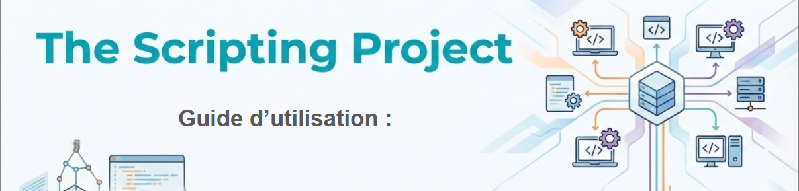

# 📘 Guide Utilisateur - Projet TSSR-1025-P2-G4



Ce document détaille l'installation et l'utilisation des outils d'administration système développés dans le cadre du projet P2. Ces scripts permettent d'administrer à distance des postes clients (Windows et Linux) depuis des serveurs de gestion centralisés.

## 📋 Table des matières

1. [Présentation](#-présentation-)
    
2. [Prérequis](#-prérequis-)
    
3. [Installation](#-installation-)
    
4. [Utilisation du Script Bash sur le Serveur Debian](#-utilisation-du-script-bash-sur-le-serveur-debian)
    
5. [Utilisation du Script PowerShell sur le Serveur Windows](#-utilisation-du-script-powershell-sur-le-serveur-windows-)
    
6. [Fonctionnalités Détaillées](#-fonctionnalités-détaillées-)
    
7. [Dépannage](#-dépannage-)
    

---

## 🎯 Présentation

Le projet met à disposition deux scripts principaux permettant d'effectuer des tâches d'administration courantes de manière automatisée et sécurisée à travers le réseau :

- **Scripts Bash** : Exécuté depuis un serveur Debian, il administre les clients via SSH.
    
- **Scripts PowerShell** : Exécuté depuis un serveur Windows 2022, il administre les clients via WinRM/PowerShell Remoting.
    

**Objectifs principaux :**

- Gestion des utilisateurs (création, suppression, modification).
    
- Gestion de l'alimentation des postes (arrêt, redémarrage).
    
- Récupération d'informations système.
    
- Journalisation centralisée des actions.
    

---

## 💻 Prérequis

### Architecture Réseau

L'environnement doit comporter les machines suivantes (ou équivalentes) :

- **SRVLX01** : Serveur Debian 12.9 (Machine de contrôle Linux).
    
- **SRVWIN01** : Serveur Windows 2022 (Machine de contrôle Windows).
    
- **CLILIN01** : Client Ubuntu 24.04 LTS.
    
- **CLIWIN01** : Client Windows 10 Pro.
    

### Configuration Requise

- **Réseau** : Toutes les machines doivent pouvoir communiquer entre elles (ping OK).
    
- **Protocoles** :
    
    - Le service **SSH** doit être activé et configuré sur les machines Linux.
        
    - Le service **WinRM** doit être activé sur les machines Windows.
        
- **Droits** : Vous devez disposer d'un compte avec privilèges administrateur/sudo sur les machines cibles.
    

---

## 🚀 Installation

### 1. Récupération du projet

- Clonez le dépôt GitHub sur vos serveurs d'administration (SRVLX01 et SRVWIN01) :

```
git clone https://github.com/WildCodeSchool/TSSR-1025-P2-G4.git
```


### 2. Préparation sur Debian CLI (Script Bash)


- Vous rendre dans le répertoire Scripts.  

```
cd Répertoire_choisi_pour_récupérer_le_dépôt/TSSR-1025-P2-G4/Scripts
```

- Copier ensuite le répertoire scripts_debian dans votre répertoire personnel pour qu'il puisse être fonctionnel.   

```
cp -r scripts_debian ~/scripts_debian
```

- Rendez le tout le répertoire exécutable.

```
sudo chmod +x scripts_debian
```

- Et enfin rendez-vous dans le répertoire pour accéder au script parent.

```
cd scripts_debian
```

Voilà, vous êtes prêt à lancer le script bash !

### 3. Préparation sur Windows Server GUI (Script PowerShell)


- Récupérer le répertoire scripts_windows_server qui est lui-même situé dans le répertoire Scripts.   

- Copier ensuite le répertoire scripts_windows_server dans votre répertoire personnel pour qu'il puisse être fonctionnel.  

- Ouvrir une invite de commande PowerShell en tant qu'Administrateur et autorisez l'exécution de scripts .

```
Set-ExecutionPolicy RemoteSigned
```

- Vous rendre enfin dans le répertoire  C:\Users\Votre_Nom_Utilisateur\scripts_windows_server par le biais de l'invite de commande.

```
Set-Location C:\Users\Votre_Nom_Utilisateur\scripts_windows_server
```

Voilà, vous êtes prêt à lancer le script powershell !

---

## 🐧 Utilisation du Script Bash

Ce script est conçu pour être lancé depuis le serveur **SRVLX01** qui est sous l'OS Debian.


### Lancement

- Taper et valider.

```
./menu_serveur.sh
```

- Attention de ne surtout pas lancer le script comme ceci `sudo ./menu_serveur.sh` en tant super utilisateur et donc en mode sudo !

### Navigation

- Le script affiche un **Menu Principal** interactif. Vous avez le choix entre 2 menus : Se connecter pour réaliser des actions sur la machine Client Linux ou la machine Client Windows.
    
- Utilisez les touches du clavier (numéros) pour sélectionner une option.
    
- Taper ensuite l'adresse correspondant à la machine à laquelle vous voulez vous connecter :
	 172.16.40.30 pour le Client Linux.
	 172.16.40.20 pour le Client Windows.
	 - Attention ! Avant toute manipulation vous devrez connaître le mot de passe du compte sur la Machine Client en question ainsi que le vôtre sur la Machine Serveur. Vous serez amené à le saisir pour plusieurs manipulations.
	
- Taper ensuite l'un des utilisateurs affichés pour vous connecter à son compte.
	
- Chaque sous-menu dispose d'une option "Retour" ou "Quitter/Sortir".


### Options disponibles

1. **Gestion des Actions de la Machine** : Redémarrer, prise à distance, activer ou désactiver le pare-feu ainsi que son état ou encore une gestion de répertoires sur la machine distante.
    
2. **Gestion des Utilisateurs** : Créer, supprimer ou modifier un utilisateur ainsi que la récupération de certains infos à propos de ce dernier sur la machine distante. (N'est malheureusement pas encore aboutie pour le client Windows.)
    
3. **Informations Système** : Récupérer les informations réseaux, système et matériel ou encore la recherche de logs sur l'OS.

-  Si vous souhaitez voir le fichier log à propos de l'utilisation de la machine, il faut vous rendre dans le fichier situé log dans /var/log/log_evt.log.


---

## 🪟 Utilisation du Script PowerShell

Ce script est conçu pour être lancé depuis le serveur **SRVWIN01**.

### Lancement

PowerShell

```
.\main_script.ps1
```

_(Assurez-vous d'être dans le bon répertoire contenant le script)_

### Navigation

L'interface est similaire à la version Bash, utilisant un menu textuel clair.

### Options disponibles

1. **Administration Utilisateurs** : Gestion des comptes locaux et Active Directory (si configuré).
    
2. **Gestion Postes** : Actions de redémarrage et d'arrêt à distance via WinRM.
    
3. **Audit & Infos** : Collecte d'informations WMI/CIM sur les clients.
    
4. **Journalisation** : Les actions sont automatiquement enregistrées dans un fichier de log (par défaut dans un dossier `Logs` ou `C:\Logs`).
    

---

## 🛠 Fonctionnalités Détaillées

### Gestion des Utilisateurs

- **Création** : Vous serez invité à saisir le nom du nouveau compte et son mot de passe.
    
- **Suppression** : Nécessite le nom exact de l'utilisateur à supprimer.
    
- **Sécurité** : Les mots de passe saisis sont masqués ou traités de manière sécurisée lors de l'envoi.
    

### Ciblage des Machines

Les scripts permettent de choisir la cible :

- Par **Adresse IP** (ex: 192.168.1.50).
    
- Par **Nom d'hôte** (ex: CLIWIN01), si la résolution DNS est active.
    

### Journaux (Logs)

Chaque action critique (suppression d'un utilisateur, arrêt d'une machine) est horodatée et enregistrée.

- **Bash** : Vérifiez le fichier `activity.log` (ou similaire) dans le dossier du script.
    
- **PowerShell** : Vérifiez le fichier `.log` généré dans le répertoire d'exécution.
    

---

## ❓ Dépannage

**Problème : "Connexion refusée" ou "Access Denied"**

- Vérifiez que le pare-feu autorise le port 22 (SSH) ou 5985/5986 (WinRM).
    
- Vérifiez que les identifiants administrateur fournis sont corrects.
    

**Problème : Le script PowerShell ne se lance pas**

- Vérifiez la politique d'exécution : `Get-ExecutionPolicy`. Elle ne doit pas être sur `Restricted`.
    

**Problème : Caractères bizarres dans le menu (Linux)**

- Vérifiez l'encodage de votre terminal (UTF-8 recommandé).
    

---

_Ce projet a été réalisé par l'équipe G4 de la promotion TSSR-1025._
